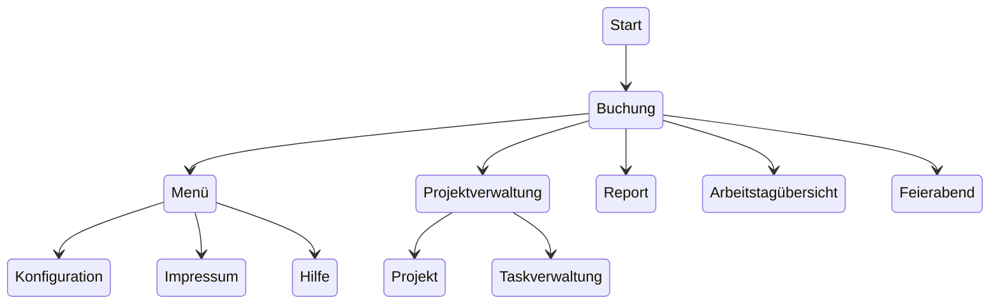
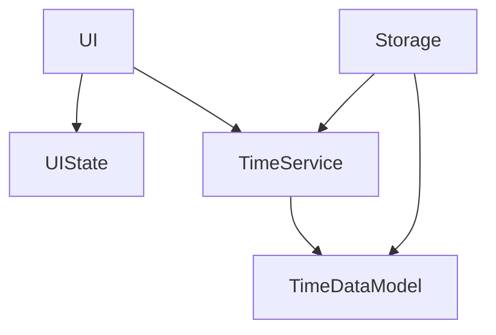
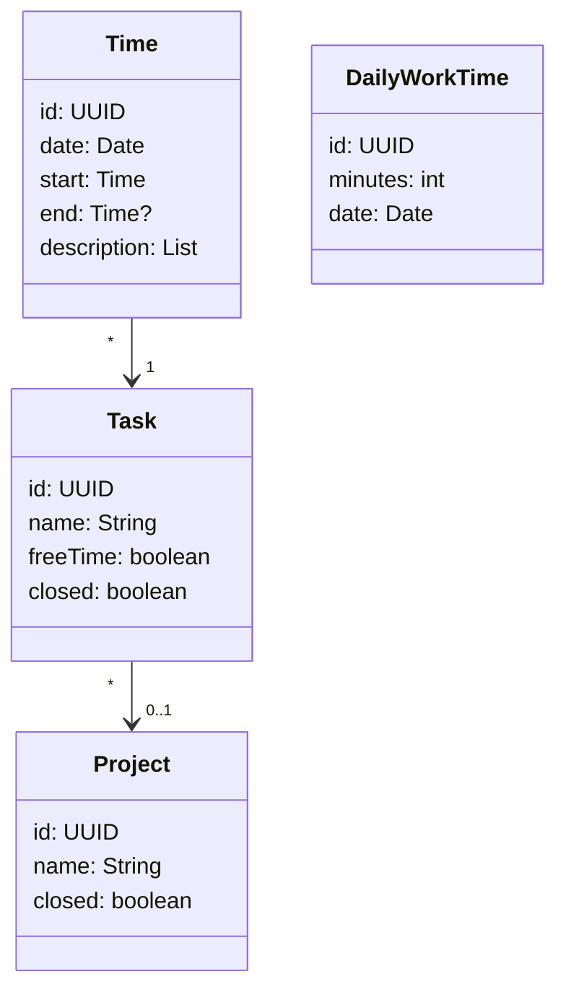

# Work Time to Track

## Ziel

Ein einfaches Zeit-Tracking-Tool für einen einzelnen Benutzer auf Android/Desktop.

## Anforderungen

* Der Benutzer kann beliebige Projekte definieren.
* Der Benutzer kann beliebige Task für ein Projekt definieren.
* Der Benutzer kann ein Projekt schließen.
* Der Benutzer kann einen Task schließen.
* Der Benutzer kann eine Zeit (Startzeitpunkt, Endzeitpunkt, Datum) für einen Task eintragen.
* Der Benutzer kann eine tägliche Arbeitszeit pro Tag festlegen.
* Der Benutzer kann sich die gebuchte Gesamtzeit sowie die Über-/Unterstunden anzeigen.
* Der Benutzer kann sich die gebuchte Zeit pro Projekt und Task für einen Zeitraum anzeigen lassen.
* Der Benutzer kann sich einen PDF-Report für einen definierten Zeitraum generieren lassen.
* Der Benutzer kann nachträglich Projekte, Tasks und Zeiten verändern.
* Der Benutzer kann Notizen zu seiner gebuchten Zeit hinzufügen.

## Randbedingungen

* Ein Arbeitstag geht von 0:00 bis 24:00. Arbeitszeiten über Mitternacht werden nicht unterstützt. Die
  Endzeit ist immer maximal 24:00.

## UI-Workflow

Der Benutzer bekommt eine Liste von Tasks angezeigt. Durch Auswählen eines Tasks
wird dieser als Buchungszeit gestartet. Er kann jederzeit einen anderen Task auswählen, dadurch wird die aktuelle Buchungszeit suspendiert.
Wenn der Benutzer den aktuellen Task wiederum auswählt, wird dieser beendet und die Buchungszeit abgeschlossen. Falls in dem Fall eine suspendierte Buchungszeit
vorhanden ist, wird dieser wieder aktiv. Das System löst überlappende Buchungszeiten so, dass mehrere überlappungsfreie Buchungszeiten erstellt werden, d.h. tatsächlich schließt
das System die alte Buchungszeit ab und startet eine neue Buchungszeit, sobald der aktuelle Task wieder beendet wird.

Falls eine Buchungszeit vorhanden ist, die max. vor 5 Minuten (kann konfiguriert werden) beendet wurde, startet die aktuelle Buchungszeit mit dem Ende der vorherigen Buchungszeit. Beispiel: Task A endet um 10:30, Task B startet um 10:32 → Task B beginnt um 10:30

Statt einen Task zu beenden, kann der Benutzer auch die Feierabend-Abfrage starten.
Hier kann der Benutzer für den Tag die zu erreichende Arbeitszeit angeben, der aktive Task wird geschlossen.
Die Feierabend-Abfrage ist nur aktiv, wenn ein aktiver Task oder eine Buchungszeit für den aktuellen Tag existiert.
Pro Tag kann es nur eine Arbeitszeit geben, eine vorhandene Arbeitszeit wird überschrieben (Sollzeit pro Tag ist einzigartig (letzter Eintrag überschreibt), gebuchte Zeiten können mehrere sein).

In einer separaten Oberfläche kann der Benutzer Projekte verwalten (Erzeugen oder verändern). Projekte/Tasks ohne eine
Zeit können jederzeit gelöscht werden.
Weiterhin kann der Benutzer freie Tasks anlegen, verändern oder löschen (ohne Projektbezug UND mit Kennzeichnung freie Zeit).

## Zeitberechnung

Die Arbeitszeit gibt an, wie viele Minuten an einem Tag gearbeitet werden muss. Für jeden Tag gibt es einen Eintrag.
Die gearbeitete Zeit pro Tag ergibt sich aus der Summe gebuchten Zeiten.

Sonderfall, falls das Datenmodell inkonsistent ist: Bei überlappenden Zeiten wird der gesamte Zeitraum, vom Start der ersten Buchungszeit bis zum Ende der letzten Buchungszeit,
benutzt.

Freie Buchungszeiten (der entsprechende Task ist als "frei" markiert) werden ignoriert.

## UI

- Von jedem Screen kann man mit dem Zurückbutton (Android: System, Desktop: expliziter Button) zu dem vorherigen Screen zurück.
- Wenn kein expliziter Speicher-Button vorhanden ist, speichert der Zrück-Button automatisch.
- Falls ein Speicher-Button vorhanden ist, verwirft der Zurück-Button.
- Ein Speicherbutton sichert die Änderungen, falls dieser nicht gedrückt wird, werden die Änderungen verworfen.
- Ein Zurück-Button speichert nie, in dem Fall, dass kein Speicherbutton vorhanden ist, werden Änderungen immer sofort übernommen.

### Buchungs-Screen

- Liste von Tasks, sortiert nach zuletzt benutzt, die Liste zeigt zuerst den Namen, dann das Projekt, jeder Eintrag kann ausgewählt werden
- Ein ausgewählter Eintrag wird hervorgehoben.
- Es gibt zwei weitere Buttons über der Liste:
    - Pause: Der aktuelle Task wird "suspendiert", alle Tasks sind nicht mehr auswählbar, die Buchungszeit wird beendet.
    - durch erneutes Auswählen des Pause-Buttons wird der letzte Task fortgesetzt, indem eine neue Buchungszeit angelegt wird. Dies ist nur möglich, wenn am aktuellen Tag bereits eine Buchungszeit vorhanden war. Falls kein aktiver Task vorhanden ist, ist der Button zum Fortsetzen nur aktiv, wenn mindestens eine beendete Buchung am selben Tag existiert.
    - Feierabend/Logoff: Der Tag wird beendet, es wird der Feierabend gestartet.
- Am unteren Rand wird ein Textfeld mit Absenden-Button angezeigt. Dies ist nur aktiv, wenn auch ein Task
  aktiv ist. Der abgesendete Text wird zu der aktiven Buchungszeit hinzugefügt.
- Tasks die "Freie Zeit" gesetzt haben, werden mit einem Freizeit (z.B. Sonnenschirm)-Icon dargestellt.
- Neben der Startzeit des aktiven Tasks kann die Startzeit mit zwei Buttons um eine konfigurierte Anzahl
  Minuten vor- oder zurückgeschoben werden. Änderungen werden sofort gespeichert. Teilen sich die aktive
  und die unmittelbar vorherige Buchung eine Grenze oder überschreitet ein Vorziehen eine bestehende Lücke,
  wird die Endzeit der vorherigen Buchung atomar mitverschoben. Abgeschlossene Buchungen bleiben mindestens
  eine Minute lang und die aktive Startzeit darf nicht nach der aktuellen Uhrzeit liegen.

### Feierabend-Screen

Es wird ein Screen mit dem Titel "Arbeitszeit" dargestellt. Es werden folgende Daten angezeigt:

- aktuelles Datum
- Zeitpunkt der ersten Buchungszeit
- Zeitpunkt der letzten Buchungszeit
- Gearbeitete Stunden:Minuten
- Eingabe der Sollstunden in Stunden:Minuten, es wird der Default-Wert vorausgewählt.
    - Hinweis: Da jederzeit eine neue Buchungszeit/Task am selben Tag gestartet werden kann, wird
      in diesem Fall die existierenden Sollstunden angezeigt.
- Speichern Button

### Konfigurationsscreen

- Default Sollstunden in Stunden:Minuten für die Vorauswahl im Feierabend-Screen
- Buchungszeiten "Mergezeit"
- Verschiebezeit für die Startzeit aktiver Buchungen (1 bis 30 Minuten, Standard: 5 Minuten)
- Alle Einstellungen werden persistent in der Datenbank gespeichert und beim Öffnen des Screens geladen.
- Theme und Sprache werden beim Anwendungsstart automatisch aus den gespeicherten Einstellungen geladen und angewendet.

### Impressum-Screen

Es wird das Impressum dargestellt.

### Hilfe-Screen

Es wird ein Hilfetext für die Bedienung der App dargestellt.

### Projektverwaltung-Screen

- Es wird eine Liste von Projekten dargestellt. Durch Tippen auf ein Projekt wird man zu dem Taskverwaltung-Screen weitergeleitet.
- Es gibt einen Eintrag für projektlose Tasks, dieser kann weder gelöscht noch verändert werden.
- Bei jedem Projekt gibt es zwei Icons:
    - Löschen (Falls keine Buchungszeit für alle Tasks des Projekts vorhanden ist)
    - Bearbeiten: Öffnen des Projekt-Screens
- Es gibt einen "+"-Button um einen neuen Task hinzuzufügen (öffnet Projekt-Screen)

### Projekt-Screen

- Der Name des Projekts kann geändert werden.
- Das Projekt kann geschlossen werden: Im Buchungs-Screen werden keine Tasks mehr von diesem Projekt angezeigt.
- Ein leerer Projektname ist NICHT erlaubt
- Der Projektname muss eindeutig sein.
- Es gibt einen Speicher-Button.

### Taskverwaltung

- Es wird der Name des Projekts dargestellt.
- Es wird eine Liste von Tasks zu dem Projekt dargestellt.

### Task-Screen

- Es wird der Name des Projekts dargestellt.
- Der Name des Tasks kann verändert werden.
- Der Task kann geschlossen werden: Im Buchungs-Screen wird dieser nicht mehr angezeigt.
- Ein leerer Taskname ist NICHT erlaubt
- Der Taskname muss eindeutig sein.
- Es gibt einen Speicher-Button.

## Design

### Komponenten

- UI: Darstellung der Daten und Verwaltung durch den Benutzer
- UIState: View-Model der aktuell dargestellten Daten
- TimeService: Verwaltung der Daten (Speichern, Laden, Suchen, ), sowie der Berechnungen
- Storage: Sichern des Datenmodells in einem permanenten Store (aktuell SQLite)

### Backend Datenmodell (TimeDataModel)

# Technische Architektur

- Kotlin Multiplatform Project
- Lokale Datenhaltung mit SQLite
- I18N
- MVVM Pattern
- Persistenter State der UI
- Service zum Speichern des Datenmodells

# Erweiterung

- PDF Generierung
- Cloud Speicher
- Dark Mode

## **🔧 Technische Hinweise**

1. **Kotlin Multiplatform:**

- Shared-Code in `shared` Modul (Business-Logik, Datenmodell).
- Plattform-spezifischer Code in `androidApp`/`desktopApp` (UI, Dateisystemzugriff).

2. **Datenbank:**

- **SQLDelight** (empfohlen für KMP) oder **Room** (nur Android).
- Für Desktop: SQLite über **SQLDrizzle** oder **Exposed**.

3. **PDF-Generierung:**

- **iText 7** (Kotlin/JVM) oder **Apache PDFBox** (Java).
- Für Android: **Android PDF Writer** oder **iTextGPL**.

4. **UI:**

- **Compose Multiplatform** für gemeinsame UI-Logik.
- Plattform-spezifische Anpassungen (z. B. Navigation, Dateipicker).

5. **State-Management:**

- **Kotlin Flow** + **State** für reaktive UI-Updates.
- **ViewModel** für jeden Screen.

6. **Testing:**

- **JUnit 5** für Unit Tests.
- **Kotlin Test** + **Turbine** für Flow-Tests.
- **Compose Testing** für UI-Tests.
