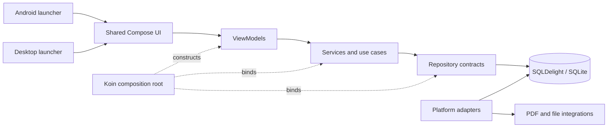

# Architecture decision record and compliance review

Date: 2026-08-02

This document reconstructs the architectural decisions currently made by WorkTime2Track. The repository did not previously contain formal ADR files, so a decision is marked **accepted** only when it is stated in the concept or implementation plans and is also reflected in the current implementation. Ideas mentioned only as alternatives or future work are listed separately.

## System context

WorkTime2Track is a local-first, single-user time-tracking application for Android and JVM desktop. It records projects, tasks, bookings, daily target time, settings, and report data in a local database. Most application behavior and UI are shared; the launchers and integrations with native storage, database drivers, localization, scrollbars, and PDF APIs vary by platform.



## Decision catalogue

| ID      | Status                   | Decision                                                                                                                                            | Principal evidence                                                           |
|---------|--------------------------|-----------------------------------------------------------------------------------------------------------------------------------------------------|------------------------------------------------------------------------------|
| ADR-001 | Accepted                 | Target Android and JVM desktop with Kotlin Multiplatform and JDK/JVM 17.                                                                            | `settings.gradle.kts`; `shared/build.gradle.kts`; `docs/plan/phase1.md`      |
| ADR-002 | Accepted                 | Put reusable domain, persistence, UI, and resources in `shared`; keep launchers and native integrations platform-specific.                          | `README.md`; `shared/src/*Main`; `androidApp`; `desktopApp`                  |
| ADR-003 | Accepted with violations | Use a layered MVVM structure: `data` models/repositories, `domain` services/use cases, and `ui` screens/view models.                                | `docs/Konzept.md`; `docs/plan/phase1.md`; package structure                  |
| ADR-004 | Accepted                 | Use Compose Multiplatform for the shared UI and Material 3 components.                                                                              | `shared/build.gradle.kts`; `shared/src/commonMain/.../ui`                    |
| ADR-005 | Accepted                 | Use Kotlin `Flow`/`StateFlow` for reactive persistence and screen state, and lifecycle `ViewModel` plus structured coroutines for actions.          | repository contracts; `ui/viewmodel`                                         |
| ADR-006 | Accepted with violation  | Persist local application data in SQLite through SQLDelight repositories.                                                                           | `WorkTimeDatabase.sq`; `SqlDelightRepositories.kt`; platform Koin modules    |
| ADR-007 | Superseded by ADR-019    | Put business workflows in services/use cases and persistence behind repository contracts and `StorageService`.                                      | Historical decision                                                          |
| ADR-008 | Accepted                 | Use Koin as the composition root, with a shared module and platform modules.                                                                        | `di/Koin.kt`; `di/Koin.android.kt`; `di/Koin.jvm.kt`                         |
| ADR-009 | Accepted                 | Model domain records as immutable, serializable Kotlin data classes, with string UUID identifiers and `kotlinx.datetime` date/time values.          | `data/model`                                                                 |
| ADR-010 | Accepted                 | Isolate unavoidable platform behavior behind source-set implementations or common interfaces.                                                       | database drivers; `LanguageEnvironment`; scrollbar adapters; `ReportService` |
| ADR-011 | Accepted                 | Use a small, shared, typed in-memory navigation stack instead of a platform navigation framework.                                                   | `ui/navigation/Navigation.kt`; `App.kt`                                      |
| ADR-012 | Accepted with violation  | Externalize UI text in shared Compose resources, support German and English, support light/dark/system themes, and persist language/theme settings. | `composeResources`; `ui/theme`; `App.kt`; `ConfigViewModel.kt`               |
| ADR-013 | Accepted                 | Generate report content/layout in shared code and render/write it with platform implementations (Android PDF API and PDFBox on desktop).            | `ReportGenerator.kt`; platform `ReportService` implementations               |
| ADR-014 | Accepted                 | Export/import a complete, versioned JSON database snapshot and replace data transactionally on import.                                              | `DatabaseExportRepository.kt`                                                |
| ADR-015 | Accepted                 | Apply multi-record day edits through a validating use case and one SQL transaction.                                                                 | `UpdateDayUseCase.kt`; `DayRepository`; `SqlDelightDayRepository`            |
| ADR-016 | Accepted with violation  | Test shared logic in common tests against a real SQLDelight database, with target-specific tests for platform implementations.                      | `docs/integration-testing.md`; common/JVM/Android test source sets           |
| ADR-017 | Accepted                 | Generate target-specific CycloneDX SBOMs under build output and package them as generated resources for the in-app library view.                    | root/shared build scripts; `SBOMService.kt`; `LibraryScreen.kt`              |
| ADR-018 | Accepted                 | Remain local-first; cloud synchronization is an extension point, not a current persistence path.                                                    | `docs/Konzept.md`; `CloudStorageService.kt`; Koin dummy binding              |
| ADR-019 | Accepted                 | Expose persistence through feature-oriented use cases instead of a cross-feature storage façade.                                                    | `domain/usecase`; `data/repository`; `di/Koin.kt`                            |

## Decision details

### ADR-001 and ADR-002: multiplatform modules and ownership

The project has one shared KMP module, plus thin Android and desktop application modules. Common code owns the application model, SQL queries, repository contracts, business rules, view models, Compose screens, navigation, and resources. Platform source sets own APIs that cannot be shared. This keeps behavior consistent between targets and makes target-specific code an adapter rather than a second application implementation.

Consequence: a dependency on Android, AWT, `java.io`, or another platform API must not be introduced into `commonMain`. Such behavior needs a common contract and target implementation.

### ADR-003 through ADR-008: layers, state, persistence, and construction

The intended request/data flow is:

```text
Screen -> ViewModel -> Feature UseCase -> Repository contract -> SQLDelight implementation -> SQLite
```

Repositories expose reactive reads as `Flow` and suspending writes. View models expose immutable
`StateFlow` values and launch actions in `viewModelScope`. Koin binds SQLDelight implementations to repository contracts and supplies shared and platform services. `App` is the UI composition point that selects screens and constructs most view models.

The repository currently places model and repository contracts under `data`, so this is a pragmatic layered MVVM design rather than strict Clean Architecture. A dependency from `domain` to these contracts is therefore not classified as a violation without a separate decision that requires dependency inversion around a standalone domain module. Presentation code may use immutable `data.model` values, but must not access repository, storage, or generated database packages; an ArchUnit test enforces this boundary.

### ADR-019: feature-oriented use cases

`StorageService` aggregated unrelated repositories and let presentation select persistence paths. Booking, day editing, configuration, project management, reporting, and backup instead expose feature use cases. Each use case owns workflow validation and depends directly on its minimum repository contracts. Repository methods own SQL transaction boundaries; Koin only composes implementations and feature use cases.

Reporting loads each selected period from a bounded snapshot rather than querying once per displayed day. Presentation cancels superseded overview loads, so a slower previous request cannot replace a newer period.

### ADR-009: model representation and invariants

`Project`, `Task`, `Time`, and `DailyWorkTime` are immutable serializable values. IDs are generated as UUID strings, and temporal values use multiplatform date/time types. Entity-local invariants such as nonblank project/task names are checked by constructors; cross-record invariants such as unique names, nonoverlapping edited bookings, and atomic day replacement are handled by services/use cases.

Consequence: import paths and low-level repositories must either validate the same invariants or the database must enforce them, because those paths can bypass services.

### ADR-010: platform adapter boundary

Android and desktop select different SQLite drivers and PDF backends. Locale application and scrollbar behavior use `expect`/`actual`; PDF generation uses a common interface and shared drawing algorithm with target implementations. Native file pickers remain in the launcher modules.

### ADR-011 and ADR-012: application shell

Navigation is represented by a sealed set of destinations and a Compose-backed stack. Theme and language are application-level state, initialized from the configuration table. Localized strings come from shared German/default and English resource sets, allowing the same screens to be used by both targets.

### ADR-013: report architecture

Report data and pagination/layout are platform-neutral. A `ReportDrawingSurface` adapter maps the shared algorithm to Android Canvas/PDF and PDFBox. The platform launcher owns destination selection where a native picker is required.

### ADR-014 and ADR-015: transactional bulk changes

Backups are complete JSON snapshots with an explicit format version and tolerance for unknown JSON keys. Restore deletes and reinserts all records inside one SQLDelight transaction. Editing a day likewise validates the complete draft, sorts entries, then replaces bookings and target time in one transaction. These choices provide failure atomicity for operations spanning multiple tables.

### ADR-016 and ADR-017: verification and supply-chain visibility

Shared tests can use an in-memory or inspectable persistent database with the production schema and repository/service graph. Platform tests cover driver configuration and PDF behavior.

CycloneDX generates application SBOMs only under ignored build directories. Compose's generated-resource DSL packages the desktop SBOM from `desktopApp`'s runtime classpath into `jvmMain` and the Android SBOM from `androidApp`'s release runtime classpath into `androidMain`. The application reads either target resource through the stable `files/sbom.json` path.

Release SBOMs are target-specific rather than normalized. An Android artifact describes its release dependency graph regardless of build host. A desktop artifact describes the Compose Desktop runtime selected for its build host, so every supported desktop release must be built and packaged on that host. CycloneDX serial numbers and timestamps remain dynamic because they identify the generated artifact; reproducibility is enforced by keeping those outputs outside version control rather than rewriting provenance fields. The aggregate `cyclonedxBom` remains available under the root build reports for whole-repository analysis but is not embedded in an application.

### ADR-018: local-first scope

SQLite is the sole active source of truth. `CloudStorageService` defines a future seam but is bound to a no-op implementation. Cloud synchronization remains deferred and must not be described as an implemented storage path.

## Architecture violations

### V-003 — Planned service abstractions were not created (medium)

The phase-one architecture explicitly calls for business-logic interfaces for `TimeService`,
`StorageService`, and `ProjectService`. They are concrete final classes and Koin binds them directly. Only platform/future services such as `ReportService` and `CloudStorageService` have interfaces. This is drift from ADR-003/ADR-007 and limits substitution in tests and alternative implementations.

Evidence: `docs/plan/phase1.md:21-27`; `domain/service/TimeService.kt:17`;
`domain/service/StorageService.kt:17`; `domain/service/ProjectService.kt:11`; `di/Koin.kt:39-43`.

Before correcting, decide whether interfaces are still required. If not, amend the architectural plan instead of adding one-implementation interfaces solely for conformance.

### V-004 — “Persistent UI state” is only partially implemented (medium)

Theme and language preferences persist, but navigation and screen state do not survive process recreation. The navigation stack is created with `remember`, view models are manually created with
`remember`, and the view models use plain `MutableStateFlow`; no saved-state mechanism is present. This only satisfies persistence across recomposition, not the persistent UI state promised by the concept.

Evidence: `docs/Konzept.md:208-209`; `App.kt:39-41`, `:88`, `:129-136`;
`ui/navigation/Navigation.kt:44-48`; view models' `MutableStateFlow` fields.

Recommended correction: clarify whether the decision means persisted preferences or restorable navigation/form drafts. If it means restoration, define serializable destination state and use a saved-state mechanism appropriate to shared Compose/view models.

### V-007 — Platform output location has inconsistent contract semantics (low)

`ReportService.generatePdfReport` calls its destination a `fileName`. Desktop interprets it as a filesystem path, while Android interprets it as a content URI. The common contract therefore leaks platform-specific destination semantics and is easy to misuse.

Evidence: `domain/service/ReportService.kt:54-57`; Android implementation `:16-18`; JVM implementation `:13-20`.

Recommended correction: keep report generation byte-/sink-oriented in shared code and let launchers write to their native destination, or introduce an explicitly opaque destination abstraction.

### V-008 — A platform resource integration test lives in `commonTest` (medium)

`SBOMServiceTest.loadsBundledSbom` exercises Compose's runtime resource reader from `commonTest`. That test passes on JVM desktop but is also inherited by the Android host-test compilation, where the resource reader calls `android.util.Log` and fails because the Android method is not mocked. A platform integration assumption has therefore leaked into the supposedly portable test suite, contradicting ADR-016's split between common logic tests and target-specific integration tests.

Evidence: `shared/src/commonTest/kotlin/net/npg/wt2t/domain/service/SBOMServiceTest.kt:12-17`. Reproduced with `./gradlew :shared:testAndroidHostTest`: 46 tests executed, with
`loadsBundledSbom` as the sole failure (`Method d in android.util.Log not mocked`).

Recommended correction: keep parser tests in `commonTest`, move bundled-resource loading assertions to target test source sets, or inject a platform-neutral byte/resource reader into `SBOMService`.

## Guideline observations outside ADR compliance

These do not change the decision catalogue, but they conflict with repository coding guidance:

- Some production comments are German, although code and documentation are required to be English (`BookingViewModel.kt:62`, `TimeService.kt:38`, `TimeService.kt:44`).
- Several broad `catch (Exception)` blocks discard failures, including Koin initialization in
  `MainActivity.kt:39-45`; the rules require caught exceptions to be handled or enriched with context.
- Several files combine many concepts and exceed the guideline for small, focused classes/files, notably `EditDayScreen.kt`, `DailyOverviewScreen.kt`, `MenuScreen.kt`, and
  `SqlDelightRepositories.kt`.

## Mentioned but not accepted decisions

The following are proposals or superseded alternatives, not current ADRs:

- Room, Exposed, and SQLDrizzle were considered persistence alternatives; SQLDelight is implemented.
- iText and other PDF writers were considered; PDFBox is used on desktop and Android's PDF API is used on Android.
- Cloud storage is future work; the current implementation is a no-op extension point.
- A separate report screen appears in planning/navigation, but current export is initiated from the daily overview and `Screen.Report` is only a placeholder.

## Review priorities

1. Protect stored data: fix V-005 and validate imports in V-006.
2. Restore platform separation: fix V-001 and clarify the destination contract in V-007.
3. Restore the declared presentation boundary: fix V-002.
4. Restore target-independent tests: fix V-008.
5. Resolve architectural-document drift: decide V-003 and clarify V-004.
